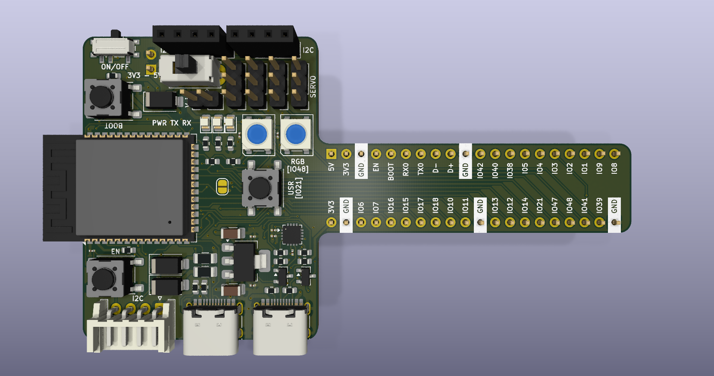
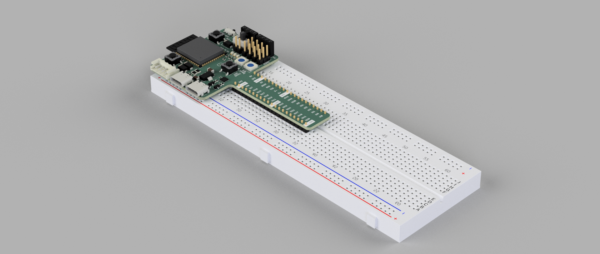
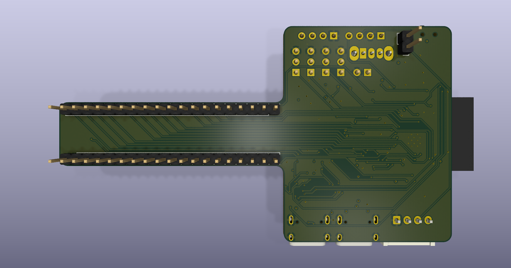
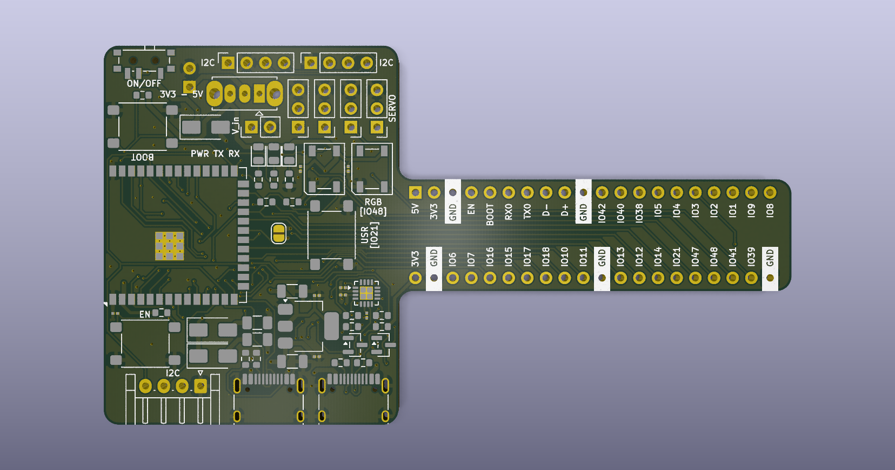
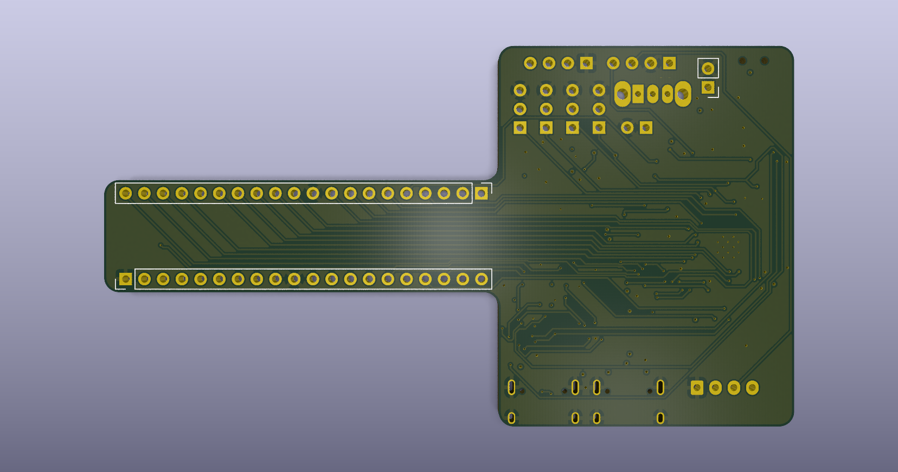

<p align="center">
  
</p>

<h1 align="center">ESP32-S3-TBone</h1>

<p align="center">
  <em>Custom T-bone form-factor ESP32-S3 development board engineered to resolve solderless breadboard real estate constraints by exposing dual-sided tie points.</em>
</p>

<p align="center">
  
  
  
  
</p>

---

## 📋 Project Overview

The **ESP32-S3-TBone** is a purpose-engineered development board built around the **ESP32-S3-WROOM-1** module. Unlike standard rectangular devkits that monopolize the entire breadboard, the T-bone form factor features a narrowed neck section that straddles the center channel while the head section extends beyond the breadboard edge — freeing up **both sides** of the breadboard for prototyping access to all GPIO tie points.

### Key Design Goals

- **Maximize breadboard usable area** — dual-sided tie point access for all broken-out GPIOs.
- **Signal integrity first** — 4-layer controlled-impedance stackup with dedicated ground and power reference planes.
- **Manufacturing ready** — Gerber-optimized output with DFM rule compliance for standard PCB fabs (JLCPCB, PCBWay, OSH Park).
- **Mechanical validation** — 3D collision-checked against standard 830-point breadboard models in Fusion 360.

---

## 🏗️ Hardware Architecture & Stackup

### MCU: ESP32-S3-WROOM-1

| Parameter        | Specification                           |
| ---------------- | --------------------------------------- |
| Core             | Xtensa® dual-core 32-bit LX7           |
| Clock            | Up to 240 MHz                           |
| Flash            | 16 MB (Quad SPI)                        |
| SRAM             | 512 KB                                  |
| Connectivity     | Wi-Fi 802.11 b/g/n + Bluetooth 5 (LE)  |
| USB              | Native USB 2.0 OTG + UART via CH343P   |
| GPIO             | Fully broken-out via dual header rows   |

### 4-Layer PCB Stackup

```
┌─────────────────────────────────────────────────────────┐
│  Layer 1 — F.Cu (Top)                                   │
│  → High-density signal routing, component pads,         │
│    USB differential pairs, crystal oscillator traces     │
├─────────────────────────────────────────────────────────┤
│  Layer 2 — In1.Cu (Inner 1)                             │
│  → Solid continuous ground (GND) reference plane        │
│    Provides low-impedance return path for all signals   │
├─────────────────────────────────────────────────────────┤
│  Layer 3 — In2.Cu (Inner 2)                             │
│  → Partitioned low-impedance power planes               │
│    • 3V3 polygon pour — main logic supply               │
│    • 5V rail — USB VBUS passthrough                     │
│    • VBUS — upstream USB input power                    │
├─────────────────────────────────────────────────────────┤
│  Layer 4 — B.Cu (Bottom)                                │
│  → Bottom interconnects, ground return stitching,       │
│    thermal relief pads, and auxiliary signal routing     │
└─────────────────────────────────────────────────────────┘
```

---

## 🔧 Design For Manufacturability (DFM) & Layout

### EMI Shielding — Perimeter Via Stitching
A continuous array of stitching vias along the board perimeter connects the top and bottom ground pours, forming a **Faraday cage** effect. This:
- Contains return currents within the board stackup
- Reduces edge-radiated EMI emissions
- Improves ground plane continuity at board boundaries

### Neck Corner Geometry — CNC Routing Clearance
The interior corners at the T-bone neck-to-head transition use **chamfered/radiused fillets** to accommodate standard CNC routing bit diameters (≥ 0.8 mm). Sharp 90° interior corners are physically impossible to mill and would cause fabrication rejects.

### Soldermask-Clipped Silkscreen
The `--subtract-soldermask` flag was used during Gerber generation to automatically **clip silkscreen artwork** wherever it overlaps exposed copper pads. This prevents:
- Ink-on-pad contamination during soldering
- Poor solder wetting on component pads
- IPC-A-610 Class 2/3 violations

### USB Type-C CC Pull-Down Logic
Both USB-C ports implement the correct **CC1/CC2 pull-down resistor** network (5.1 kΩ to GND) on each Configuration Channel pin, advertising the device as a **UFP (Upstream Facing Port)** sink per USB Type-C spec Rev 2.0. This ensures reliable cable detection and power negotiation with all USB-C hosts and chargers.

---

## 🧊 Mechanical Validation

The board outline (exported as `.step` from KiCad) was imported into **Autodesk Fusion 360** alongside a reference breadboard CAD model to perform:

1. **Collision detection** — verify zero interference between the PCB body and breadboard clips/housing.
2. **Tie-point clearance** — confirm all header pins align with breadboard hole pitch (2.54 mm / 0.1").
3. **Overhang validation** — ensure the head section clears the breadboard edge without cantilever instability.

<p align="center">
  
</p>

---

## 📸 Gallery

| Front (3D Render) | Back (3D Render) |
|---|---|
|  |  |

| Front (No Components) | Back (No Components) |
|---|---|
|  |  |

---

## 📁 Directory Structure

```
ESP32-S3-TBone/
├── hardware/
│   ├── schematics/
│   │   ├── schematic.pdf            # Exported schematic drawing (PDF)
│   │   └── v1.0.kicad_sch           # KiCad schematic source
│   ├── pcb/
│   │   ├── v1.0.kicad_pcb           # KiCad PCB layout source
│   │   ├── v1.0.kicad_pro           # KiCad project file
│   │   └── v1.0.kicad_dru           # KiCad design rules
│   ├── gerbers/
│   │   ├── gerbers.zip              # Production-ready Gerber + Drill archive
│   │   ├── v1.0-F_Cu.gtl            # Front copper
│   │   ├── v1.0-In1_Cu.g1           # Inner layer 1 (GND plane)
│   │   ├── v1.0-In2_Cu.g2           # Inner layer 2 (Power planes)
│   │   ├── v1.0-B_Cu.gbl            # Back copper
│   │   ├── v1.0-F_Mask.gts          # Front solder mask
│   │   ├── v1.0-B_Mask.gbs          # Back solder mask
│   │   ├── v1.0-F_Silkscreen.gto    # Front silkscreen
│   │   ├── v1.0-B_Silkscreen.gbo    # Back silkscreen
│   │   ├── v1.0-Edge_Cuts.gm1       # Board outline
│   │   ├── v1.0.drl                 # Excellon drill file
│   │   ├── v1.0-drl_map.gbr         # Drill map (Gerber X2)
│   │   └── ...                      # Additional fabrication layers
│   └── mechanical/
│       ├── ESP32-S3-TBone.step       # 3D STEP assembly export
│       ├── Breadboard.fbx            # Breadboard reference model
│       └── breadboard-reference.glb  # Breadboard GLB model
├── docs/
│   └── images/
│       ├── 3d-front.png              # Front 3D render
│       ├── 3d-back.png               # Back 3D render
│       ├── 3d-front-no-components.png
│       ├── 3d-back-no-components.png
│       ├── breadboard-fit.png        # Breadboard fit verification
│       └── comparison.png            # Size comparison
├── .gitignore
├── LICENSE                            # MIT License
└── README.md                          # This file
```

---

## 🛠️ Regenerating Manufacturing Files

If you modify the KiCad source files, regenerate all outputs using `kicad-cli`:

```bash
# Gerber layers (with soldermask-clipped silkscreen)
kicad-cli pcb export gerbers --subtract-soldermask \
  -o hardware/gerbers/ hardware/pcb/v1.0.kicad_pcb

# Excellon drill files + Gerber X2 drill map
kicad-cli pcb export drill --generate-map --map-format gerberx2 \
  -o hardware/gerbers/ hardware/pcb/v1.0.kicad_pcb

# Schematic PDF
kicad-cli sch export pdf \
  -o hardware/schematics/schematic.pdf hardware/schematics/v1.0.kicad_sch

# STEP 3D assembly (skip DNP, substitute models)
kicad-cli pcb export step --no-dnp --subst-models \
  -o hardware/mechanical/ESP32-S3-TBone.step hardware/pcb/v1.0.kicad_pcb
```

---

## 📜 License

This project is licensed under the **MIT License** — see the [LICENSE](./LICENSE) file for details.

---

<p align="center">
  <sub>Designed & engineered by <a href="https://github.com/M7md0010">@M7md0010</a></sub>
</p>
